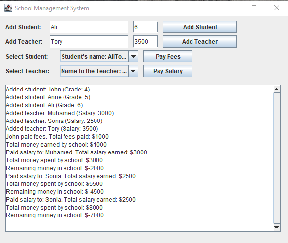

# Student Management System



## Description

Student Management System is a Java Swing-based desktop application designed to help educational institutions manage student data, courses, and faculty. It provides a clear and intuitive interface for adding, editing, viewing, and reporting on student and teacher records.

## Features

* Add, edit, and delete student records
* Add, edit, and delete teacher records
* Assign students to courses and track enrollment
* View and search student and teacher information
* Modular code architecture separating GUI and model classes

## Prerequisites

* Java Development Kit (JDK) 11 or higher
* Maven or your preferred Java build tool
* A modern IDE (e.g., IntelliJ IDEA, Eclipse) for development and debugging

## Project Structure

```
.
├── README.md
├── LICENSE
├── specifications.txt          # Project requirements and design specifications
├── Student_Management_System_screenshot.png            # Application screenshot
└── src/
     ├── Main.java                 # Application entry point
     ├── School.java               # Model class for school details
     ├── Student.java              # Model class for student data
     ├── Teacher.java              # Model class for teacher data
     └── SchoolManagementSystemGUI.java  # GUI implementation and event handling
```

## Installation & Running

1. **Clone the repository**

   ```bash
   git clone https://github.com/yourusername/StudentManagementSystem.git
   cd StudentManagementSystem
   ```

2. **Build the project**

   ```bash
   mvn clean package
   ```

   Or compile manually:

   ```bash
   javac -d out $(find src -name "*.java")
   ```

3. **Run the application**

   ```bash
   java -cp out com.example.sms.Main
   ```

## Usage

1. Launch the application to open the main window.
2. Use the **Students** menu to add, edit, or remove student records.
3. Use the **Teachers** menu to manage teacher information.
4. Assign students to courses under the **Enrollment** section.
5. Use the search bar to quickly locate records by name or ID.

## Specifications

Refer to `specifications.txt` for detailed functional requirements, UML diagrams, and data models.

## Screenshots


## Contributing

Contributions welcome! Please submit issues for bugs or feature requests, and send pull requests for improvements.

## License

This project is licensed under the MIT License. See the [LICENSE](/LICENSE) file for details.
